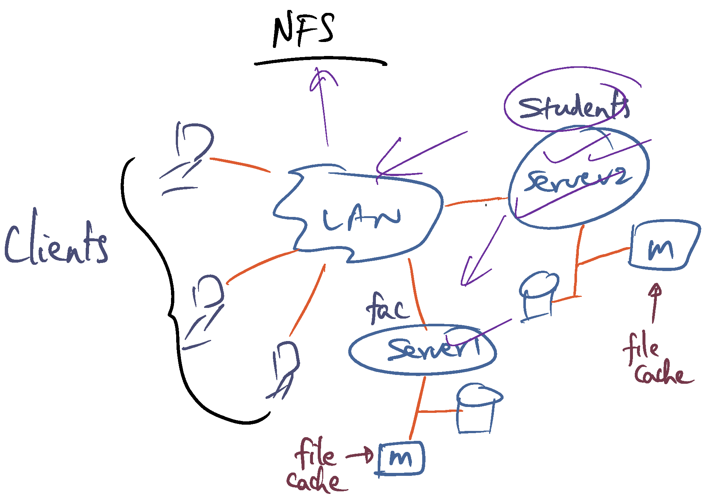

# Distributed File System (DFS)

In this lecture, we will cover 

## Network file systems (NFS)

Before starting talking about distributed file system, let us first review the network file system. 

Network file systems (NFS) has evolved over time, but the time is still the same. As shown in 

Thought experiment: _How to use the cluster memory for cooperative cahcing of files ?_

## Prelimiaries: Striping a File to Multiple Disks

- Increase I/O bandwidth by stripping to parallel discks
- Failure protection by **ECC**

Drawbacks:
+ Cost
+ Small write problem: ??

## Prelimiaries: Log Structured File System

- Buffer changes to multiple files in on contiguous **log segment** data structure
- Plush **log segment** to disk once it fills up or periodically ==> Solves small write problem

temp files 

## Prelimiaries: Software RAID

...

## Putting Them All Together Plus More

...